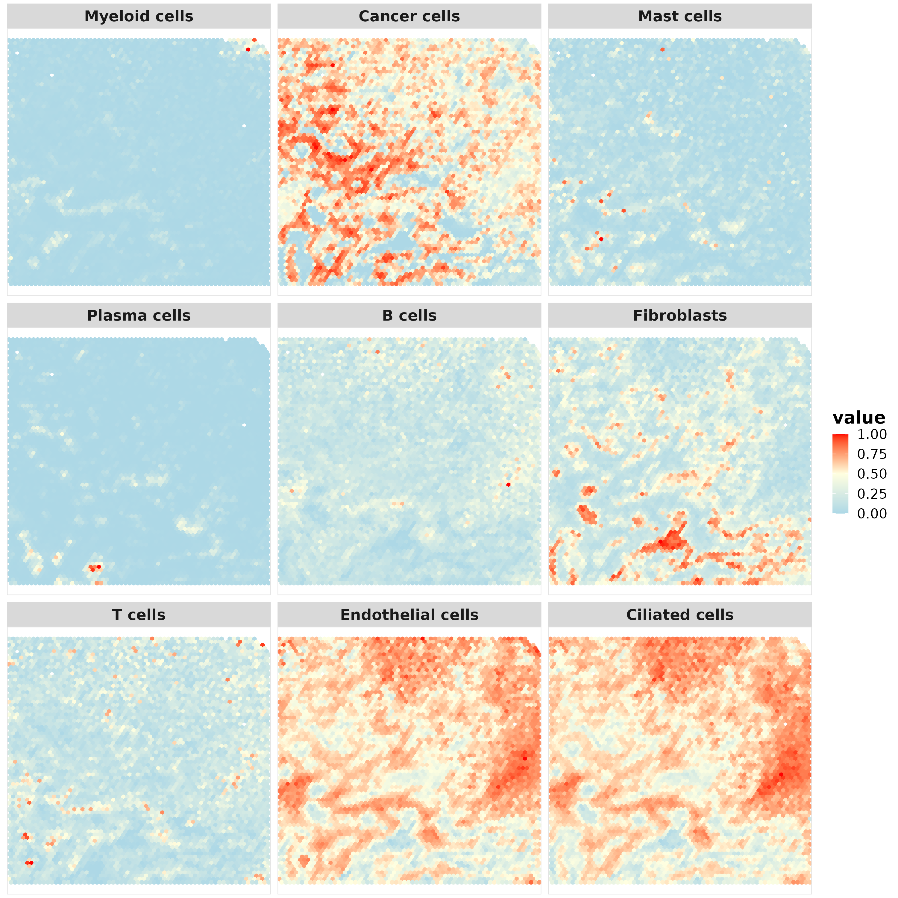
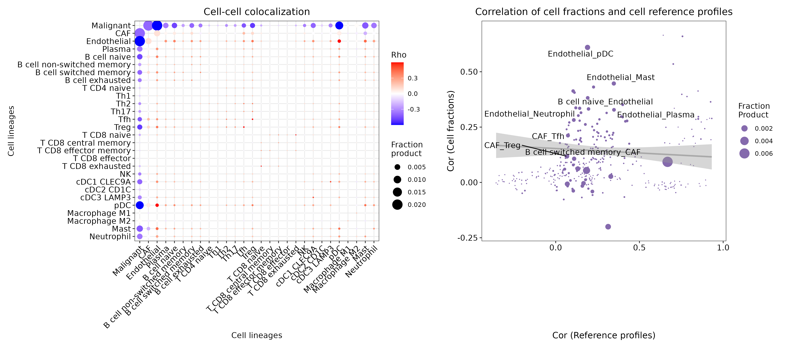
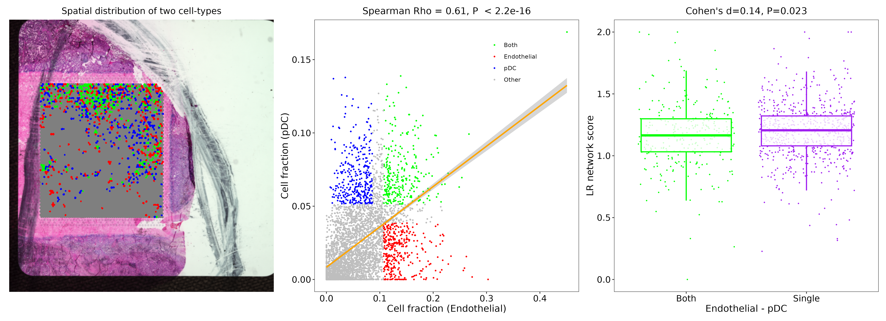

This repo contains the code for 10X Visium Spatial Transcriptomics Analysis.

## Space Ranger Report

## Resolution Enhancing using BayeSpace

## Marker Visualizations

## Spatial-aware Clustering

## Differential Expression Between Clusters

## Cell-type Deconvolution

### Cell-type Deconvolution Based on Marker Genes

### Cell-type Deconvolution Based on Single-cell Database

### Identify Tumor-immune Interface

## Cell-Cell Colocalization and Ligand-Receptor Interaction
### Colocalization

### Ligand-Receptor Network

### Ligand-Receptor Interaction

